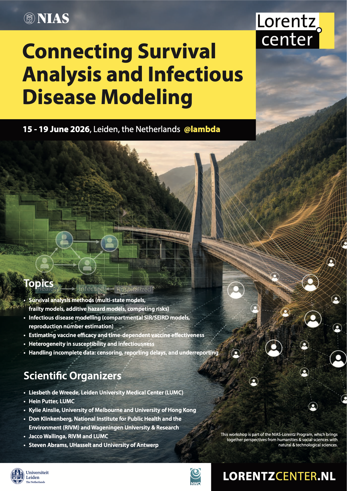

# Connecting Survival Analysis and Infectious Disease Modeling

**Lorentz Center Workshop | 15–19 June 2026 | Leiden, the Netherlands**

Website: <https://kylieainslie.github.io/lorentz_center_workshop>



---

## About

This repository contains the materials, case study data, analysis scripts, and vignettes for the SA–IDM workshop. The workshop brings together researchers from survival analysis (SA) and infectious disease modelling (IDM) to make methodological connections explicit and develop shared tools for cross-disciplinary analysis.

Over five days, participants work in mixed groups on a shared simulated epidemic dataset and collectively produce vignettes, code examples, and a "Ten Simple Rules" guide for SA–IDM integration.

## Repository Structure

```
.
├── _quarto.yml              # Quarto website configuration
├── index.qmd                # Home page
├── case-studies.qmd         # Case study overview and group questions
├── preparation.qmd          # Pre-workshop reading and setup
├── day1.qmd – day5.qmd      # Daily materials
├── organizers.qmd           # Scientific organizers
├── assets/
│   ├── presentations/       # Workshop presentations (.qmd)
│   └── case_study/          # Case study documents (PDF, DOCX)
├── data/                    # Simulated epidemic datasets (.rds)
├── analysis/
│   ├── index.qmd            # Contributor guide for group scripts
│   └── group-*/             # Group analysis scripts (one folder per group)
├── vignettes/
│   ├── index.qmd            # Vignette listing
│   ├── resources.qmd        # Papers, software, and links
│   └── vignette-group*.qmd  # Cross-disciplinary worked examples
└── docs/                    # Rendered website output (do not edit directly)
```

## Groups and Questions

| Group | Topic |
|-------|-------|
| A | Key Epidemiological Parameters |
| B | Serial Interval Distribution |
| C | Reporting Delays and Underreporting |
| D | Vaccine Effectiveness |
| E | Excess Mortality |

Each group has a dedicated branch (`group-A` through `group-E`) for analysis scripts and vignettes.

## Working with Branches

The website lives on `main`. Group work lives on branch `group-X`:

```bash
git checkout group-D          # switch to your group's branch
git pull origin group-D       # get latest changes
```

To pick up updates from `main`:

```bash
git merge main
```

## Data

Seven simulated epidemic datasets are available, all stored as `.rds` files in the `data/` directory and downloadable from the [Case Study page](https://kylieainslie.github.io/lorentz_center_workshop/case-studies.html).

| File | Contents |
|------|----------|
| `demographic_data.rds` | Individual-level age, sex, household, classroom, and workplace IDs |
| `incidence_data_day40.rds` | Confirmed cases and hospitalisations up to day 40, with symptom onset and reporting times |
| `incidence_data_reduced.rds` | Limited case information covering the remainder of the outbreak |
| `sero_data.rds` | Repeated cross-sectional serological surveys at days 10, 20, 30, and 40 |
| `contact_tracing_data.rds` | Infector–infectee pairs with symptom onset times and contact windows (up to day 30) |
| `mortality_data.rds` | Time of death for individuals |
| `vaccination_data.rds` | Time of vaccination for individuals (up to day 90) |

> The complete individual-level dataset is not revealed until the end of the workshop.

## Scientific Organizers

| Name | Affiliation |
|------|-------------|
| Liesbeth de Wreede | Leiden University Medical Center (LUMC) |
| Hein Putter | Leiden University Medical Center (LUMC) |
| Kylie Ainslie | University of Melbourne & University of Hong Kong |
| Don Klinkenberg | RIVM & Wageningen University and Research |
| Jacco Wallinga | RIVM & Leiden University Medical Center (LUMC) |
| Steven Abrams | UHasselt & University of Antwerp |

## License

This work is licensed under [Creative Commons Attribution 4.0 International (CC BY 4.0)](https://creativecommons.org/licenses/by/4.0/). You are free to share and adapt the materials for any purpose, provided appropriate credit is given.
