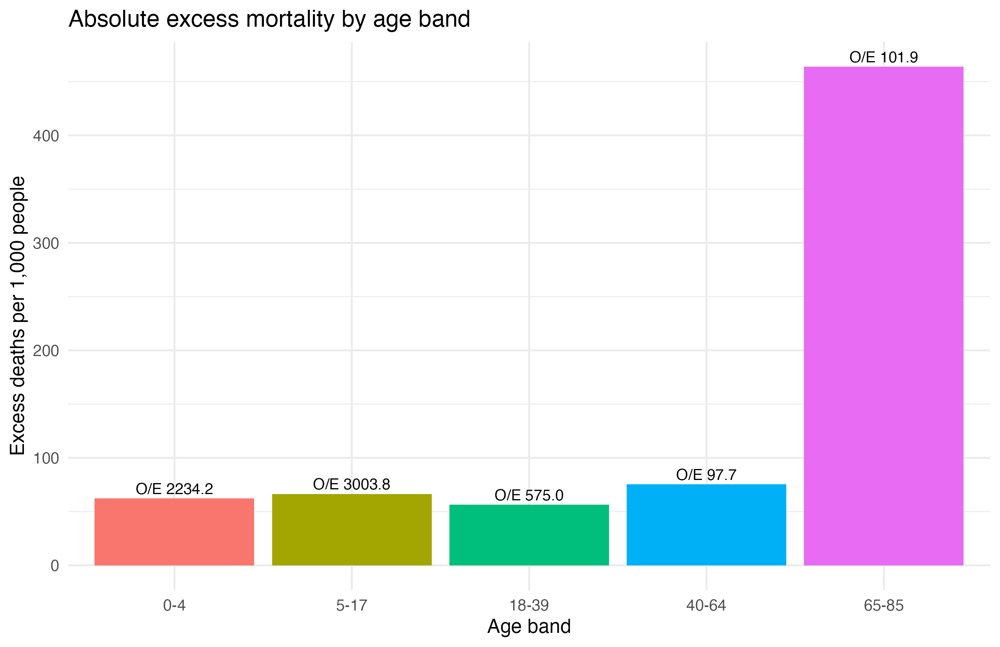

```{r}
data_checks <- read.csv("results/data_checks.csv")
model_overview <- read.csv("results/model_overview.csv")
model_coefficients <- read.csv("results/model_coefficients.csv")
profile_summary <- read.csv("results/profile_prediction_summary_2020.csv")
sensitivity_summary <- read.csv("results/year_sensitivity_summary.csv")
```

## Summary

This report estimates excess mortality in the full demographic, mortality, and vaccination cohort using relative survival methods. Expected mortality comes from the population life table in `data/mltper_1x1.txt` and `data/fltper_1x1.txt`, while the formal models use time-dependent vaccination to avoid immortal-time bias.

The primary analysis anchors the ratetable to calendar year 2020. Sensitivity analyses repeat the formal models with 2019 and 2023 anchor years.

## Data Checks

```{r}
knitr::kable(data_checks, digits = 3)
```

## Exploratory Analysis

The cohort shows a strong separation between observed and expected mortality by 90 days, with marked heterogeneity by age and additional variation across sex, school membership, workplace membership, and vaccination state.





## Relative Survival Models

The formal analysis fits three additive relative survival models:

1. No covariates
2. Minimal model with age band, sex, and time-dependent vaccination
3. Extended model with age band, sex, time-dependent vaccination, school membership, and worker status

```{r}
knitr::kable(model_overview, digits = 3)
```

```{r}
primary_coefficients <- subset(
  model_coefficients,
  anchor_year == 2020 & component == "covariate"
)
knitr::kable(primary_coefficients, digits = 3)
```


## Net Survival

The net survival curves from `rs.surv()` show the same broad pattern: separation is strongest by age, while fixed risk-factor strata show smaller but still visible differences.


## Representative Profiles

Model-based cumulative excess mortality was computed from the primary extended model for several representative profiles, including an older adult vaccinated at day 45.

```{r}
knitr::kable(profile_summary, digits = 4)
```


## Ratetable-Year Sensitivity

The main sensitivity check compares the excess hazard ratio estimates across the 2019, 2020, and 2023 anchor years. The vaccination effect remains strongly protective across all three choices.

```{r}
knitr::kable(sensitivity_summary, digits = 3)
```


