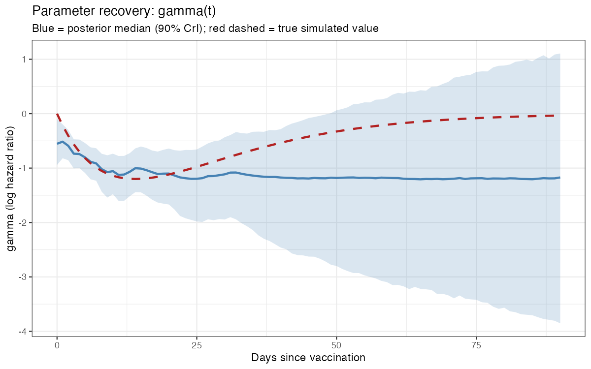
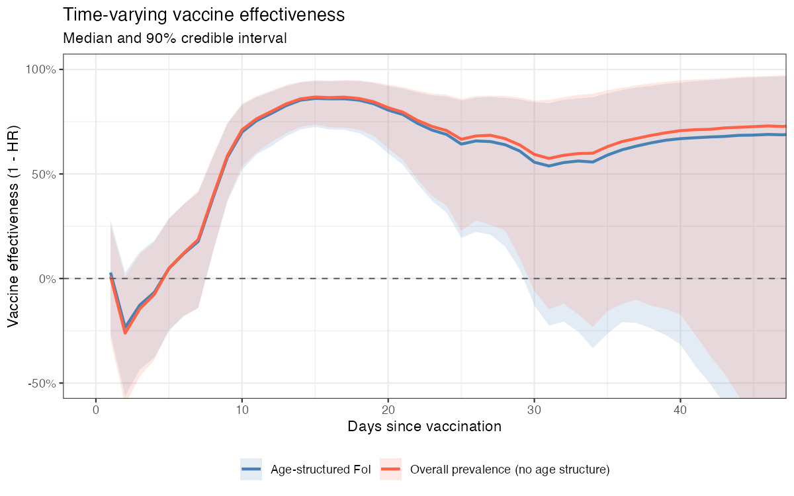

---
title: "Not all exposures are created equal"
author: "Fanny Bergström, David Price, Nathalie Dean, Hein Putter, Kylie Ainslie"
date: today
---

## Project Aim

In this project, we aim to improve the statistical efficiency of vaccine effectiveness (VE) estimation by leveraging data on the estimated force of infection experienced by different subpopulations.

Consider age subpopulations $a = 1,\dots,A$. In mechanistic models, the force of infection experienced by subpopulation $a$ is a weighted sum of contact rates and the number currently infectious:

$$\lambda_a(t_c) = \beta \sum_{a'=1}^{A} \frac{C_{a'a}}{N_a} I_{a'}(t_c)$$

where $\beta$ is the transmission rate, $C_{a'a}$ is the per-capita contact rate from age group $a'$ to age group $a$, $N_a$ is the population size of group $a$, and $I_{a'}(t_c)$ is the number currently infectious in group $a'$ at calendar time $t_c$. Not all individuals face the same infectious pressure: a child in school faces different contact patterns than a retired adult, and if vaccination reduces infectiousness as well as susceptibility the vaccination status of contacts further varies exposure. 

## Scientific Background

Time-varying VE is routinely estimated from observational data using Cox proportional hazards models with a time-varying vaccine coefficient. A persistent difficulty is that the *apparent* waning of VE conflates three distinct phenomena:

1. **Biological waning** of vaccine-induced immune protection over time since vaccination.
2. **Differential depletion of susceptibles**: vaccinated individuals who remain uninfected are a selected group; the same is true of unvaccinated individuals but the selection forces differ.
3. **Temporal and structural variation in the force of infection**: the infectious pressure to which individuals are exposed varies both over calendar time (epidemic waves) and across age groups (heterogeneous contact patterns).

A standard Cox model can adjust for age as a proportional covariate, but the proportional hazards assumption fixes the *ratio* of hazards between age groups as constant over calendar time. In reality, the infectious pressure experienced by each age group changes dynamically as the epidemic evolves and as the age distribution of infectious individuals shifts. A child's excess hazard relative to an elderly adult is not constant — it depends on who is currently infectious and how much contact each group has with them. By modelling the FoI explicitly as a time-varying, age-structured offset (rather than a fixed age coefficient), we allow the age-specific baseline hazard to track the epidemic in real time. This also means that the remaining vaccine coefficient $\gamma(t)$ is estimated after accounting for differential exposure, not just differential baseline risk.

### Literature

- Mossong *et al.* 2008 *PLOS Medicine* — POLYMOD social contact study providing age-structured contact matrices: [https://doi.org/10.1371/journal.pmed.0050074](https://journals.plos.org/plosmedicine/article?id=10.1371/journal.pmed.0050074)
- Moore *et al.* 2024 *Epidemics* — age-structured FoI in VE estimation: [https://doi.org/10.1016/j.epidem.2024.100768](https://doi.org/10.1016/j.epidem.2024.100768)

## Methods

### Hazard model

Let $t$ denote time since vaccination and $t_c$ denote calendar time. For an individual in age group $a$, the instantaneous hazard of infection is modelled as:

\begin{align}
h(t, t_c, a) &= h_0(t_c, a) \exp\!\bigl(\gamma(t)\cdot V\bigr)
\end{align}

where $V \in \{0,1\}$ is the vaccination indicator and $\gamma(t)$ is the log hazard ratio associated with vaccination at time $t$ since dose receipt. Vaccine effectiveness is then $\text{VE}(t) = 1 - \exp(\gamma(t))$; $\gamma(t) < 0$ corresponds to protection.

The baseline hazard $h_0(t_c, a)$ is not left unspecified (as in a standard Cox model) but is modelled explicitly through the force of infection:

$$h_0(t_c, a) = \beta\,\bar{I}(t_c, a)$$

where $\beta$ is a scalar transmission parameter and $\bar{I}(t_c, a)$ is the age-specific effective infectious pressure at calendar time $t_c$:

$$\bar{I}(t_c, a) = \sum_{a'} \frac{C_{a'a}}{N_a}\Bigl[I_u^{a'}(t_c - 1) + (1-\theta)\,I_v^{a'}(t_c - 1)\Bigr]$$

Here $I_u^{a'}$ and $I_v^{a'}$ are the counts of unvaccinated and vaccinated infectious individuals in age group $a'$, $C_{a'a}$ is the POLYMOD contact rate from group $a'$ to group $a$, $N_a$ is the population of group $a$, and $\theta \in [0,1]$ is the assumed reduction in infectiousness among vaccinated individuals (a fixed assumption; see below). The one-day lag reflects that today's hazard depends on yesterday's prevalence.

The full hazard is therefore:

$$\log h(t, t_c, a) = \log\beta + \log\bar{I}(t_c, a) + \gamma(t)\cdot V$$

### Time-varying VE

We do not assume a parametric shape for $\gamma(t)$. Instead, $\gamma(t)$ is modelled on a **daily** grid over days since vaccination, with a **random-walk prior**:

$$\gamma(1) \sim \mathcal{N}(-1,\, 1)$$
$$\gamma(t) \mid \gamma(t-1),\sigma \sim \mathcal{N}(\gamma(t-1),\, \sigma^2), \quad t = 2, \dots, T$$

where $\sigma \sim \mathcal{N}^+(0, 0.5)$ controls day-to-day smoothness and is estimated from the data. The prior on $\gamma(1)$ encodes a weakly informative belief of ~63% VE immediately after vaccination. This non-parametric approach allows VE to rise, plateau, and wane without imposing a functional form.

### Poisson approximation to Cox

In the counting-process (person-day) representation, the Cox partial likelihood can be approximated by a Poisson likelihood. Person-days are aggregated into cells indexed by $(a, V, t_c, t)$ — age group, vaccination status, calendar day, and day since vaccination — giving event count $Y$ and person-days at risk $D$. The likelihood is:

$$Y \sim \text{Poisson}\!\Bigl(\exp\bigl(\log\beta + \log\bar{I}(t_c, a) + \log D + \gamma(t)\cdot V\bigr)\Bigr)$$

$\log\bar{I}(t_c, a)$ and $\log D$ enter as fixed offsets; $\beta$ and $\{\gamma(t)\}$ are estimated.

### Contact matrix

Age-structured contact rates $C_{a'a}$ are taken from the **POLYMOD** study (Mossong et al. 2008), restricted to **the Netherlands** and aggregated to five age groups: 0–4, 5–17, 18–49, 50–64, and 65+. The matrix is symmetrised to ensure $N_a C_{a'a} = N_{a'} C_{aa'}$.

### Comparison model

We fit two versions of the model that differ only in the FoI offset:

| Model | $\bar{I}(t_c, a)$ |
|---|---|
| **Age-structured** | Age- and contact-weighted sum (above) |
| **Overall prevalence** | $\bigl[\sum_{a'}(I_u^{a'} + (1-\theta)I_v^{a'})\bigr] / N_\text{total}$ — identical for all age groups |

The comparison isolates the contribution of age-structured contact patterns to VE estimates.

## Data

| Data source | Contents | File |
|---|---|---|
| Demographic data | Individual age and sex for the full simulated population ($N = 200{,}000$) | `demographic_data.rds` |
| Vaccination data | Date of vaccination per individual | `vaccination_data.rds` |
| Incidence data | Date of reported infection per individual | `incidence_data_reduced.rds` |
| Contact matrix | POLYMOD Netherlands, aggregated to 5 age groups | obtained via `socialmixr` |

The effective infectious count $I_u^{a'}(t_c)$ and $I_v^{a'}(t_c)$ are derived from the incidence data by back-calculating an infectious period: reported cases on day $d$ are assumed to have been infectious from day $d - \Delta_r$ to day $d - \Delta_r + D_i - 1$, where $\Delta_r = 2$ days is the assumed reporting delay and $D_i = 7$ days is the assumed infectious duration.

## Analysis

### Steps

1. **Merge data sets** — link demographic, vaccination, and incidence records on individual ID.
2. **Construct a synthetic cohort** — random sample of 10,000 individuals from the full population.
3. **Apply reporting delay correction** — shift case dates back by the assumed reporting delay to approximate true infection dates when computing prevalence.
4. **Compute $\bar{I}(t_c, a)$** — for each (calendar day, age group) cell, apply the contact-weighted prevalence formula above.
5. **Fit survival model** — Poisson approximation to Cox PH, fit in Stan with a random-walk prior on $\gamma(t)$.

### Assumptions

- **Assumption 1**: No differential under-reporting by vaccination status or over calendar time. Any systematic difference in testing behaviour between vaccinated and unvaccinated individuals would bias $\gamma(t)$.
- **Assumption 2**: The reduction in infectiousness among vaccinated individuals is $\theta = 0.5$ (i.e. vaccinated infectious individuals transmit at half the rate of unvaccinated infectious individuals). This affects the computation of $\bar{I}$ but not the survival likelihood directly. Sensitivity analyses varying $\theta \in \{0, 0.25, 0.75, 1\}$ are warranted.
- **Assumption 3**: The infectious period and reporting delay are fixed at 7 and 2 days respectively. Uncertainty in these quantities propagates into $\bar{I}$ but is not currently propagated into the posterior.
- **Assumption 4**: Contact patterns are stable over the study period and follow the POLYMOD Netherlands estimates. Behavioural changes during epidemic periods (e.g. reduced contacts) would violate this.

### Implementation

Steps 1–4 are implemented in [`data_wrangling.R`](../analysis/group-D/data_wrangling.R) and [`prepare_stan_data.R`](../analysis/group-D/prepare_stan_data.R), which build the time-varying cohort, compute $\bar{I}(t_c, a)$ from background incidence and the POLYMOD contact matrix, and aggregate person-days into cells by age group, vaccination status, calendar day, and days since vaccination.

Step 5 is implemented in [`model.stan`](../analysis/group-D/model.stan) and run via [`run_model.R`](../analysis/group-D/run_model.R), which fits both the age-structured and overall-prevalence models and produces a comparison plot of $\text{VE}(t)$.

### Simulation-based validation

[`simulate_validate.R`](../analysis/group-D/simulate_validate.R) checks parameter recovery: it simulates $Y$ under a known $\log\beta$ and a known rise-then-wane $\gamma(t)$, using the real covariate structure, then refits the model and compares.



## Results

- $\log\beta$ recovers accurately (e.g. true $-4.4$ vs. posterior median $-4.40$).
- $\gamma(t)$ recovers well for roughly the first two weeks since vaccination, then flattens instead of tracking the true waning, with rapidly widening uncertainty. This tracks event sparsity in the vaccinated arm (events drop to near zero by day ~13–20 despite ample person-time remaining), not a model or sampling failure — confirmed after fixing earlier sampler diagnostic issues via a non-centered parameterization ([`model_noncentered.stan`](../analysis/group-D/model_noncentered.stan)).
- In the real-data fit, VE rises to ~88% by day 15 then appears to plateau around 70–72% from day 45–90. Given the above, this late plateau is likely prior-driven rather than a genuine finding. There is also an early dip to about −22% around day 2–3, plausibly a reporting-delay artifact.



## Discussion and Limitations

- **Sparse late follow-up**: VE estimates are data-driven only out to roughly where vaccinated-arm events still occur (~2–3 weeks since vaccination in this cohort); later time points are prior-driven. Larger cohorts or longer follow-up would extend the informative window.
- **Reporting delay**: The early dip near day 0–3 likely reflects contamination from cases whose true infection predated vaccination but whose report date did not. Formally correcting for reporting delay in the survival analysis (step 3) is an important next step.
- **Competing risks**: Death during follow-up is not modelled as a competing risk. For older age groups or severe-disease outcomes this could introduce bias.
- **Target trial emulation**: The synthetic cohort is a random sample of the full population rather than a formally emulated trial. A proper target trial emulation framework (with explicit eligibility criteria, a defined index date per individual, and per-protocol and intention-to-treat analyses) would strengthen causal interpretation.
- **Depletion of susceptibles**: Differential depletion is partially addressed by modelling vaccination status as time-varying, but the FoI offset does not yet account for the fact that the remaining susceptible pool at time $t_c$ is a non-random subset of the original population.
- **Fixed $\theta$**: The assumed 50% reduction in infectiousness for vaccinated individuals is not estimated from data. Incorporating $\theta$ as a parameter (with appropriate identifiability constraints) would quantify sensitivity to this assumption.

## Session Info

```{r}
sessionInfo()
```
